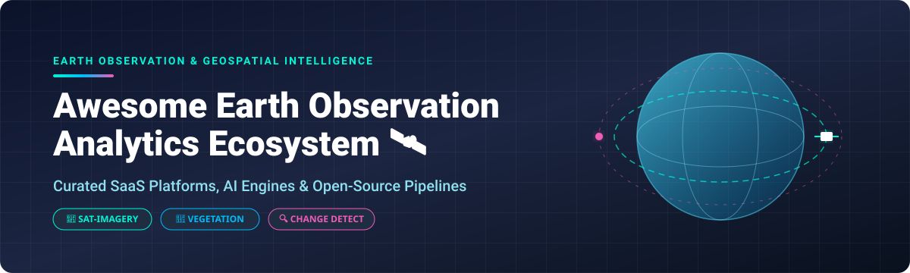

# Awesome Earth Observation Analytics 🛰️🌍

  

  
  
  
  
  
  

  <b>A curated list of top Earth Observation (EO) SaaS platforms, satellite imagery analysis tools, AI/ML change detection engines, and open-source geospatial repositories.</b>

  <a href="README.md">English 🇬🇧</a> | <a href="README_zh.md">中文 🇨🇳</a>

---

## 📌 Overview

The **Earth Observation (EO) & Remote Sensing Analytics** market is currently valued at approximately **$5.2 Billion USD** and is projected to expand to over **$11.8 Billion USD by 2032** (CAGR ~9.5%). 

The sector is **moderately fragmented**: commercial high-resolution data collection and satellite constellations are concentrated among a few heavyweights (e.g., Planet Labs, Maxar, Spire), whereas the analytics, machine learning processing, and downstream application layer remains fragmented with specialized SaaS providers and custom open-source solutions.

This repository tracks top commercial **SaaS platforms** and **open-source frameworks** empowering analysts, developers, and researchers to process satellite imagery, monitor vegetation (NDVI), perform bi-temporal change detection, and build scalable geospatial data cubes.

---

## 📑 Table of Contents

- [☁️ SaaS & Commercial Platforms](#️-saas--commercial-platforms)
- [🔓 Open-Source GitHub Projects](#-open-source-github-projects)
- [🛠️ Additional Open-Source & Data Options](#️-additional-open-source--data-options)
- [🤝 How to Contribute](#-how-to-contribute)
- [❤️ Support & Sponsorship](#️-support--sponsorship)
- [📈 Star History](#-star-history)
- [⚠️ Disclaimer](#️-disclaimer)

---

## ☁️ SaaS & Commercial Platforms

Commercial Earth Observation platforms categorized by corporate scale (revenue/valuation), featuring explicit pricing and free tier trial limits.

| Company / Platform | Market Scale (Revenue / Valuation) | Free Tier / Trial Limit | Pricing Model & Starting Cost | Key Focus |
| :--- | :--- | :--- | :--- | :--- |
| **[Planet Insights](https://www.planet.com/)** 🛰️ | **~$390M Revenue / ~$5.9B Valuation** (Public: NYSE PL) | Free tier available via Planet Education & Research Program (limited to 5,000 sq km/month for researchers); 14-day free trial | Commercial developer pricing starts at **~$500/month** or quota custom contracts | Daily global satellite constellation imagery, change detection & object tracking |
| **[Descartes Labs](https://descarteslabs.com/)** 🌲 | **Acquired by EarthDaily Analytics** (Est. Revenue ~$50M+) | No standard free tier; Enterprise demo available upon request | Custom enterprise contracts starting at **~$25,000/year** | Planetary-scale geospatial ML & multi-sensor data fusion for agriculture/forestry |
| **[Orbital Insight](https://orbitalinsight.com/)** 🏭 | **Est. Revenue ~$44M** (Acquired by Privateer Space in 2024) | No permanent free tier; 14-day enterprise trial on request | Enterprise platform subscriptions starting at **~$1,000/month** | AI geospatial analytics for supply chain, economic tracking & asset monitoring |
| **[EOS Data Analytics](https://eos.com/)** 🌾 | **Est. Revenue ~$18.3M** | Free plan available (Up to 3 fields / 10 hectares limit in EOS Crop Monitoring) | EOS Crop Monitoring paid plans start at **$20/month** ($0.15/ha/year) | Agricultural satellite analytics, crop health, yield prediction & land cover |
| **[UP42](https://up42.com/)** 🛒 | **Est. Revenue ~$10M** (Series A funded) | 10,000 free processing credits (~€100 value) upon account registration | Credit-based pay-as-you-go model starting at **€0.01 per credit** (Min order thresholds apply) | Earth Observation developer marketplace, satellite imagery APIs & processing blocks |
| **[SkyWatch](https://skywatch.com/)** 🛰️ | **Est. Revenue ~$8M** (Total funding ~$34M) | Free account sign-up with $50 developer data credits for testing | EarthCache API pay-as-you-go starting at **~$2.00 per sq km** (VHR data) | Single API to aggregate and purchase satellite imagery across multiple vendors |
| **[Satellogic Insights](https://satellogic.com/)** 🌍 | **Est. Revenue ~$6.5M** (Public: NASDAQ SATL) | No standard free tier; Demo access upon request | Tasking and imagery services starting at **~$3.50 per sq km** | High-frequency sub-meter satellite imagery constellation & change analytics |
| **[Picterra](https://picterra.ch/)** 🤖 | **Est. Revenue ~$3.5M** (Total funding ~$9.6M) | Free trial plan available (up to 50 detector runs & 500 MB storage limit) | Paid commercial plans start at **$150/month** (Personal / Small Business) | Geospatial AI platform for custom object detection & no-code ML model training |

---

## 🔓 Open-Source GitHub Projects

Sorted by **GitHub Stars_Count** (Descending). Click on the Stars_Badge beside any repository to inspect its stargazers.

| Repository | GitHub_Stars | Description | Focus Area |
| :--- | :---: | :--- | :--- |
| **[eolearn](https://github.com/sentinel-hub/eo-learn)** 🐍 |  | Earth observation processing framework for machine learning in Python using Sentinel-Hub. | Data Processing & ML |
| **[rasterio](https://github.com/rasterio/rasterio)** 🗺️ |  | Fast geospatial raster I/O library for Python built on top of GDAL binaries. | Raster I/O & GIS |
| **[torchgeo](https://github.com/microsoft/torchgeo)** 🔥 |  | PyTorch domain library providing datasets, transforms, and models for geospatial data. | Deep Learning & PyTorch |
| **[pystac](https://github.com/stac-utils/pystac)** 🗂️ |  | Python library for working with SpatioTemporal Asset Catalog (STAC) metadata. | STAC & Metadata |
| **[gdalcubes](https://github.com/appelmar/gdalcubes)** 🧊 |  | Heavy-duty R library & C++ engine to process Earth observation image collections as on-demand data cubes. | Data Cubes & R |
| **[eoreader](https://github.com/sertit/eoreader)** 📖 |  | Open-source, sensor-agnostic Python library simplifying the load of optical and SAR satellite imagery. | Multi-Sensor I/O |
| **[stac2cube](https://github.com/BaturalpArisoy/stac2cube)** 📊 |  | Scalable Sentinel-2 Xarray data cube generator featuring cloud masking (s2cloudless) & super-resolution. | Data Cubes & Xarray |
| **[LIGHT Change Detection](https://github.com/Pavlo-Andrianatos/LIGHT-Latent-space-change-detectIon-via-Gradient-free-tHreshold-opTimisation)** 💡 |  | Semi-supervised latent space satellite image change detection via gradient-free optimization. | Change Detection |
| **[satellite-ndvi-pipeline](https://github.com/DMN-SOLUTIONS/satellite-ndvi-pipeline)** 🛰️ |  | Automated Sentinel-2 NDVI/NDWI pipeline with QGIS plugin & AWS SAM serverless cloud API backend. | NDVI Pipeline & QGIS |
| **[unbihexium](https://github.com/unbihexium-oss/unbihexium)** 🛡️ |  | Modular EO analytics suite covering 12 domains: SAR/radar processing, DEM, stereo features & GPU inference. | SAR & Analytics Suite |
| **[Gaia](https://github.com/alonsoggpablo/gaia_rs)** 🌍 |  | Open-source utility tool for retrieving, managing, and inspecting Copernicus ESA satellite data. | ESA Data Management |
| **[PICANTEO](https://github.com/Pavlo-Andrianatos/PICANTEO)** 🏛️ |  | Modular bi-temporal remote sensing building & change detection framework using MA-Net backbones. | Bi-Temporal Segmentation |

---

## 🛠️ Additional Open-Source & Data Options

- **Data Acquisition & Raster Tools**: 
  - **[Rasterio](https://github.com/rasterio/rasterio)** - Fast Python library for raster data processing.
  - **[eoreader](https://github.com/sertit/eoreader)** - Open-source sensor-agnostic remote sensing library.
  - **[raster4ml](https://github.com/crewes/raster4ml)** - Geospatial raster processing designed for ML workflows.
- **Data Cube Processing**: 
  - **[gdalcubes](https://github.com/appelmar/gdalcubes)** - On-demand data cube engine for R/C++.
  - **[stac2cube](https://github.com/BaturalpArisoy/stac2cube)** - Python Sentinel-2 Xarray data cube generator.
- **Deep Learning Frameworks**: 
  - **[TorchGeo](https://github.com/microsoft/torchgeo)** - PyTorch domain extension for remote sensing data.
  - **[eo-learn](https://github.com/sentinel-hub/eo-learn)** - Machine learning framework for Earth observation data.
- **Free Open Data Sources**:
  - **[Copernicus Data Space Ecosystem](https://dataspace.copernicus.eu/)** - Free open access to Sentinel-1, Sentinel-2, Sentinel-3 data (34 PB+ archive).
  - **[NASA Earthdata](https://earthdata.nasa.gov/)** - LP DAAC, AppEEARS, Landsat, and MODIS open archive access.

---

## 🤝 How to Contribute

Contributions are welcome and appreciated! Follow these steps to submit a addition or correction:

1. Fork this repository.
2. Edit `README.md` or `README_zh.md` following the table formatting.
3. Ensure entries include explicit links, factual details, Stars_Counts, and clear descriptions.
4. Submit a Pull Request with a brief summary of your updates.

---

## ❤️ Support & Sponsorship

If you find this repository helpful for your geospatial research, remote sensing project, or agritech business, please consider showing your support:

- 🌟 **Star** this repository on GitHub!
- 🔀 **Fork** it to keep a copy or add your custom pipeline tools.
- 📢 **Share** with your network, colleagues, or geospatial community on Twitter/X, LinkedIn, and Reddit.
- ☕ **Buy me a coffee / Sponsor**: Support ongoing maintenance via [GitHub Sponsors](https://github.com/sponsors/ishandutta2007).

---

## 📈 Star History

---

## ⚠️ Disclaimer

- This list is **community-curated** for educational and reference purposes; it does not constitute official commercial endorsement.
- Remote sensing & Earth Observation data may contain location-sensitive information. Always comply with relevant data licensing terms, privacy standards, and local regulations.
- Self-hosted open-source software requires dedicated compute resources (GPU acceleration recommended) and ongoing infrastructure maintenance.

---

  <b>Made with ❤️ for Remote Sensing Analysts, Geospatial Software Engineers &amp; Data Scientists.</b>

